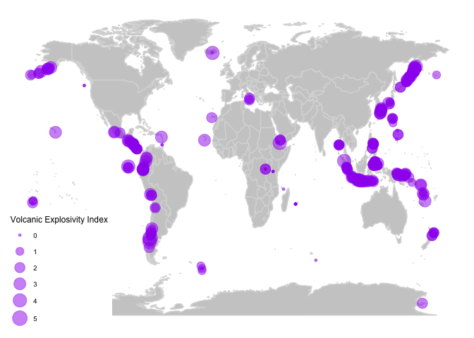

This is my contribution to [TidyTuesday](https://github.com/rfordatascience/tidytuesday/)

### In this, I’m attempting to use the gganimate package for the first time to create an animation showing volcanoe eruptions over the past century and their location.

### Packages used for this document:

    library(readxl)
    library(tidyverse)
    library(ggplot2)
    library(gganimate)
    library(maps)
    library(ggthemes)
    library(DT)
    library(gifski)

Lets take a look at the data first and see what information is here.
--------------------------------------------------------------------

    eruptions <- readr::read_csv('https://raw.githubusercontent.com/rfordatascience/tidytuesday/master/data/2020/2020-05-12/eruptions.csv')

    eruption_list <- eruptions %>% 
      janitor::clean_names() %>% 
      select(-contains("modifier"), -contains("uncertainty")) %>%
      filter(eruption_category == "Confirmed Eruption") %>%
      drop_na(end_year) %>%
      filter(end_year > 2010)

    datatable(eruption_list, rownames = FALSE,
              options = list(pageLength = 5))

Next, I’ll create an underlying map for plotting the points.
------------------------------------------------------------

    world <- ggplot() +
      borders("world", colour = "gray85", fill = "gray80") +
      theme_map() 

    map <- world +
      geom_point(aes(x = longitude, y = latitude, size = vei),
                 data = eruption_list, 
                 colour = 'purple', alpha = .5) +
      scale_size_continuous(range = c(1, 7)) +
      labs(size = 'Volcanic Explosivity Index')

    map

Now let’s animate! I did not realize going into this that the points would ‘move’ from year to year instead of appearing for that year then disappear. Something to consider for the next time I use this package.

